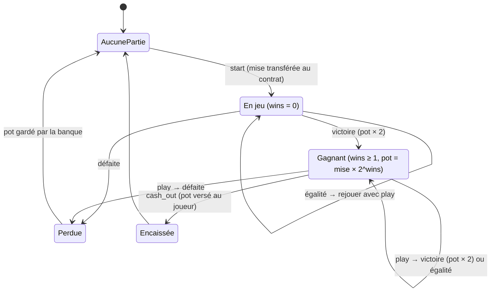

# 03 — Le contrat expliqué, bloc par bloc

> Visite guidée de `contracts/double-ou-rien/src/`. Ouvrez le code à côté : chaque
> section correspond à un bloc du fichier. Les concepts Rust sont détaillés dans
> [02-rust-pour-soroban.md](02-rust-pour-soroban.md).

## 0. Vue d'ensemble

| Fichier | Contenu | Lignes « utiles » |
|---|---|---|
| `types.rs` | les données : `Move`, `Outcome`, `Config`, `Game`, `Stats`, `BankInfo`, `DataKey` | ~60 |
| `errors.rs` | les 10 codes d'erreur | ~15 |
| `events.rs` | les 3 événements : `RoundPlayed`, `CashedOut`, `GameLost` | ~30 |
| `lib.rs` | le contrat : 10 fonctions publiques + fonctions internes | ~200 |
| `test.rs` | 18 tests unitaires | ~300 |

**Règles du jeu** : le joueur mise, puis joue contre la banque. Une victoire **double** le
pot, une égalité fait **rejouer** le tour, une défaite **perd tout**. Après une victoire, il
peut **rejouer tout le pot** (`play`) ou **encaisser** (`cash_out`).

---

## 1. Le cycle de vie d'une partie



**Stockage correspondant** (clé `DataKey::Game(joueur)`) :

| État | Ce qu'il y a dans le stockage | `get_game` renvoie |
|---|---|---|
| Aucune partie | rien | `None` (`null` en TS) |
| En jeu / Gagnant | `Game { bet, pot > 0, wins, rounds }` | `Some(game)` |
| Perdue | `Game { ..., pot: 0 }` (conservée, voir §6.4) | `None` |
| Encaissée | entrée supprimée | `None` |

---

## 2. `types.rs` — les données

### 2.1 `Move` et `Outcome`
```rust
#[contracttype]
#[derive(Clone, Copy, Debug, Eq, PartialEq)]
#[repr(u32)]
pub enum Move { Rock = 0, Paper = 1, Scissors = 2 }
```
- `#[contracttype]` rend le type utilisable en paramètre, en retour et en stockage ;
- `#[repr(u32)]` et les valeurs explicites le stockent comme un simple entier. Le front
  reçoit un `enum Move { Rock = 0, ... }` TypeScript ;
- `Move::from_index(n)` convertit le tirage aléatoire (0, 1 ou 2) en coup ;
- `a.beats(b)` contient la règle du jeu en une ligne : pierre > ciseaux > feuille > pierre.

### 2.2 `Config`
```rust
pub struct Config { pub min_bet: i128, pub max_bet: i128, pub max_multiplier: u32 }
```
Les limites économiques, modifiables par l'admin (`set_config`). Montants en **stroops**.
Valeurs déployées : mise de 1 à 10 XLM, multiplicateur maximum x32.

### 2.3 `Game`, `Stats`, `BankInfo`
- `Game` : `bet` (mise initiale), `pot` (ce que le joueur toucherait maintenant),
  `wins` (victoires, multiplicateur = 2^wins), `rounds` (tours joués, égalités comprises) ;
- `Stats` : `played`, `won` (parties **encaissées**), `lost`, `biggest_win` ;
- `BankInfo` : `balance`, `reserved` (dû aux joueurs) et `available` (la différence).

### 2.4 `DataKey` — les clés du stockage
```rust
pub enum DataKey { Admin, Token, Config, Reserved, Game(Address), Stats(Address) }
```
Chaque variante est une « case » du stockage. `Game(Address)` crée une case **par joueur**,
comme un dictionnaire `{ joueur → partie }`.

---

## 3. Instance vs persistent : où ranger quoi ?

Soroban propose 3 types de stockage. Nous en utilisons deux :

| | **Instance** | **Persistent** | *(Temporary, non utilisé)* |
|---|---|---|---|
| Portée | globale au contrat | une entrée par clé | une entrée par clé |
| TTL | **un seul**, partagé avec le contrat | un par entrée | un par entrée |
| Si le TTL expire | archivé, restaurable | archivé, restaurable | **supprimé définitivement** |
| Coût | chargé à **chaque** appel, donc à garder petit | payé seulement si on y touche | le moins cher |
| Chez nous | `Admin`, `Token`, `Config`, `Reserved` | `Game(joueur)`, `Stats(joueur)` | — |

**Pourquoi ce choix ?**
- La config, l'admin, le token et la réserve sont **petits** et **lus à chaque appel** : c'est
  le rôle de l'instance.
- Les parties et les stats sont **par joueur** et leur nombre grandit sans limite. Les
  mettre dans l'instance l'alourdirait à chaque appel pour tout le monde. Elles doivent aussi
  survivre longtemps (un joueur revient après 2 semaines), d'où le stockage persistent et non
  temporary.

### Le TTL (time to live) et `extend_ttl`
```rust
const DAY_IN_LEDGERS: u32 = 17_280;                    // 86 400 s / 5 s
const TTL_EXTEND_TO: u32 = 30 * DAY_IN_LEDGERS;        // ≈ 30 jours
const TTL_THRESHOLD: u32 = TTL_EXTEND_TO - DAY_IN_LEDGERS;  // ≈ 29 jours

fn extend_instance(env: &Env) {
    env.storage().instance().extend_ttl(TTL_THRESHOLD, TTL_EXTEND_TO);
}
```
Sur Stellar, **stocker une donnée se paie comme un loyer**, pour une durée limitée comptée
en ledgers. Quand le TTL tombe à 0, la donnée est **archivée** : les appels qui en ont
besoin échouent tant qu'elle n'a pas été restaurée (opération payante).
`extend_ttl(seuil, cible)` signifie : « si le TTL restant est **sous le seuil**, remonte-le à
la **cible** ». On prolonge donc au plus une fois par jour et par donnée, pas à chaque appel.
- **Instance** : prolongée au début de chaque fonction qui écrit (`start`, `play`, ...).
  Tant que le jeu est utilisé, le contrat ne meurt jamais.
- **Persistent** : chaque `write_game` et `write_stats` prolonge sa propre entrée.

> ⚠️ Si personne ne joue pendant plus de 30 jours, l'instance est archivée. Il faut alors
> la restaurer (`stellar contract restore`, ou `restore: true` côté SDK). Voir docs/06.

---

## 4. `errors.rs` — les codes d'erreur

```rust
#[contracterror]
#[derive(Copy, Clone, Debug, Eq, PartialEq, PartialOrd, Ord)]
#[repr(u32)]
pub enum Error { GameAlreadyInProgress = 1, /* ... */ InvalidAmount = 10 }
```
Renvoyer `Err(Error::BetTooLow)` fait échouer la transaction avec `Error(Contract, #3)`, et
**annule tout** ce que l'appel avait déjà fait. Les commentaires `///` au-dessus de chaque
variante sont recopiés dans les bindings TypeScript.

| Code | Nom | Quand ? | Fonctions |
|---:|---|---|---|
| 1 | `GameAlreadyInProgress` | une partie est déjà en cours pour ce joueur | `start` |
| 2 | `NoGameInProgress` | aucune partie en cours | `play`, `cash_out` |
| 3 | `BetTooLow` | mise < `min_bet` | `start` |
| 4 | `BetTooHigh` | mise > `max_bet` | `start` |
| 5 | `BankInsufficient` | la banque ne pourrait pas payer le pot doublé | `start`, `play` |
| 6 | `MaxMultiplierReached` | une victoire de plus dépasserait `max_multiplier` | `play` |
| 7 | `NothingToCashOut` | encaissement sans aucune victoire (égalité au 1er tour) | `cash_out` |
| 8 | `InvalidConfig` | min ≤ 0, min > max ou multiplicateur < 2 | constructeur, `set_config` |
| 9 | `InsufficientBankForWithdraw` | retrait > solde − réservé | `withdraw` |
| 10 | `InvalidAmount` | montant ≤ 0 | `withdraw` |
| — | *(erreur d'autorisation)* | `require_auth` non satisfait (ex. non-admin qui retire) | toutes les fonctions signées |

---

## 5. `events.rs` — les événements

```rust
#[contractevent]
pub struct RoundPlayed {
    #[topic] pub player: Address,
    pub player_move: Move, pub bank_move: Move, pub outcome: Outcome,
    pub pot: i128, pub wins: u32, pub rounds: u32,
}
```
Un événement est publié dans le résultat de la transaction, lisible par tous via le RPC,
mais **invisible pour les autres contrats**. Il est bon marché, et c'est la source de notre
indexeur.
- **topics** (pour filtrer) : `["round_played", joueur]`. Le nom vient de la struct en snake_case ;
- **data** : une map `{ bank_move, outcome, player_move, pot, rounds, wins }`.

| Événement | Émis par | Données |
|---|---|---|
| `round_played` | chaque tour (`start`, `play`) | coups, résultat, pot **après** le tour (0 si perdu), wins, rounds |
| `cashed_out` | `cash_out` | mise, montant versé, multiplicateur |
| `game_lost` | un tour perdu | mise, pot perdu, wins |

> Un événement est **annulé** si la transaction échoue : l'indexeur ne voit que ce qui a
> réellement eu lieu.

---

## 6. `lib.rs` — le contrat

### 6.1 Le constructeur
```rust
pub fn __constructor(env: Env, admin: Address, token: Address, config: Config) {
    if let Err(e) = validate_config(&config) {
        panic_with_error!(&env, e);
    }
    let storage = env.storage().instance();
    storage.set(&DataKey::Admin, &admin);
    storage.set(&DataKey::Token, &token);
    storage.set(&DataKey::Config, &config);
    storage.set(&DataKey::Reserved, &0i128);
    extend_instance(&env);
}
```
- Il est appelé **une seule fois**, automatiquement, pendant `stellar contract deploy`.
  Personne ne peut le rappeler pour « réinitialiser » le contrat et en prendre le contrôle,
  une faille classique des anciens contrats à fonction `init`.
- `token` est l'adresse du contrat XLM. Le contrat pourrait donc fonctionner avec
  n'importe quel token SEP-41, par exemple USDC.

### 6.2 `start(player, player_move, bet)`
Dans l'ordre :
1. `player.require_auth()` : le joueur a signé ;
2. `extend_instance` : le contrat reste en vie ;
3. vérification des limites de mise (erreurs 3 et 4) et de l'absence de partie en cours (1) ;
4. `token_client(&env).transfer(&player, &contrat, &bet)` : **la mise part chez la banque**.
   Si le joueur n'a pas les fonds, tout échoue ici ;
5. `Reserved += bet` : la mise est « due » au joueur tant que la partie dure ;
6. `stats.played += 1` ;
7. création de `Game { bet, pot: bet, wins: 0, rounds: 0 }` et **premier tour** via `play_round`.

Si `play_round` renvoie une erreur (banque insuffisante), **tout** est annulé, y compris le
transfert de l'étape 4. C'est l'atomicité des transactions.

### 6.3 `play(player, player_move)`
```rust
let mut game = read_game(&env, &player).ok_or(Error::NoGameInProgress)?;
let next_multiplier = 2u32.checked_pow(game.wins + 1);
match next_multiplier {
    Some(m) if m <= config.max_multiplier => {}
    _ => return Err(Error::MaxMultiplierReached),
}
play_round(&env, &player, &mut game, player_move)
```
Il faut une partie en cours. Si la prochaine victoire dépasserait le multiplicateur maximum,
le joueur **doit** encaisser. `checked_pow` évite tout dépassement d'entier.

### 6.4 `play_round` : le cœur du jeu
**Étape 1 : la banque peut-elle payer ?**
```rust
let reserved = read_reserved(env);
let pot_if_win = doubled_pot(game.pot);
if bank_balance(env) < reserved - game.pot + pot_if_win {
    return Err(Error::BankInsufficient);
}
```
`reserved` est la somme de **tous** les pots en cours, pour tous les joueurs. Si ce joueur
gagne, la dette de la banque devient `reserved − pot + 2·pot`. Son solde doit la couvrir.
On protège ainsi **les autres joueurs** : la banque ne promet jamais plus qu'elle n'a.

**Étape 2 : le hasard**
```rust
let random: u64 = env.prng().gen_range(0..=2);
let bank_move = Move::from_index(random);
```
⚠️ Ce PRNG est **manipulable** par un attaquant. C'est acceptable pour une démo, pas en
production. Voir [06-securite.md](06-securite.md).

**Étape 3 : la « règle d'or » des contrats à hasard**
```rust
let new_reserved = match outcome {
    Outcome::Win  => { game.pot = pot_if_win; game.wins += 1; reserved - pot_before + pot_if_win }
    Outcome::Tie  => reserved,
    Outcome::Loss => { game.pot = 0; stats.lost += 1; reserved - pot_before }
};
write_game(env, player, game);
write_reserved(env, new_reserved);
write_stats(env, player, &stats);
```
Pourquoi écrire `Game`, `Reserved` et `Stats` **dans tous les cas**, même quand rien ne
change, et pourquoi ne pas **effacer** une partie perdue ?

Le client **simule** la transaction avant de l'envoyer. La simulation détermine les
données touchées et les ressources consommées, qui deviennent des **limites**. Mais **le
hasard de la simulation n'est pas celui du vrai ledger**. Si les issues n'écrivaient pas
les mêmes données, une simulation « égalité » suivie d'une vraie « défaite » ferait échouer
la transaction (on l'a vécu : voir [07-debug.md](07-debug.md)). En écrivant toujours les
mêmes clés, avec la même taille, toutes les issues ont le même profil de coût.
Une partie perdue est donc stockée avec `pot = 0`, et `read_game` la filtre :
```rust
.get(&DataKey::Game(player.clone()))
.filter(|g: &Game| g.pot > 0)
```

**Étape 4 : les événements**
`RoundPlayed` à chaque tour, plus `GameLost` en cas de défaite.

### 6.5 `cash_out(player)`
Il faut une partie avec au moins une victoire (erreurs 2 et 7). Le contrat paie le pot
(`transfer(&contrat, &player, &pot)`), sans `require_auth` pour lui-même : un contrat
autorise implicitement les transferts depuis sa propre adresse. Ensuite : `Reserved -= pot`,
suppression de la partie, `stats.won += 1`, mise à jour de `biggest_win`, puis l'événement
`CashedOut`. Cette fonction ne dépend pas du hasard, donc supprimer la partie ne pose pas
de problème de simulation.

### 6.6 Les lectures : `get_game`, `get_stats`, `get_config`, `get_bank`
Elles sont gratuites : le front les **simule** sans jamais les envoyer, donc sans signature
ni frais.

### 6.7 L'administration : `withdraw`, `set_config`
```rust
let admin = read_admin(&env);
admin.require_auth();
// ...
let available = bank_balance(&env) - read_reserved(&env);
if amount > available { return Err(Error::InsufficientBankForWithdraw); }
```
- Seul l'admin, qui doit signer, peut appeler ces fonctions.
- Même l'admin **ne peut pas prendre l'argent promis aux joueurs** (`reserved`). C'est une
  garantie écrite dans le code, vérifiable par tous.

### 6.8 Les fonctions internes
`read_*`/`write_*` centralisent les accès au stockage, ce qui évite de répéter les clés et
de rater un `extend_ttl`. `token_client` construit le client du contrat XLM et
`bank_balance` lit le solde du contrat.

---

## 7. Les maths du jeu

### 7.1 Un tour
Le coup de la banque est uniforme (1/3 chacun). Quel que soit le coup du joueur :

| Issue | Probabilité |
|---|---|
| Victoire | 1/3 |
| Égalité (on rejoue) | 1/3 |
| Défaite | 1/3 |

Les égalités étant rejouées, un tour **décisif** est gagné avec probabilité
**(1/3) / (2/3) = 1/2**. Le nombre moyen de tours joués par tour décisif est
1 / (2/3) = **1,5**.

### 7.2 Viser x2^k
Pour encaisser à x2^k, il faut k victoires décisives d'affilée :

| Objectif | Victoires | Probabilité | Gain si réussi (mise 1 XLM) |
|---|---:|---:|---:|
| x2 | 1 | 50 % | 2 XLM |
| x4 | 2 | 25 % | 4 XLM |
| x8 | 3 | 12,5 % | 8 XLM |
| x16 | 4 | 6,25 % | 16 XLM |
| x32 | 5 | 3,125 % | 32 XLM |

### 7.3 Espérance : un jeu **équitable**
Espérance du montant récupéré en visant x2^k :
**E = (1/2)^k × 2^k × mise = mise.** Le gain moyen est nul, quelle que soit la stratégie.
Le jeu est **équitable** (choix de l'équipe) : ni le joueur ni la banque n'ont d'avantage.

> 💡 Un vrai casino ajoute un **avantage maison**, par exemple un paiement de x1,9 au lieu
> de x2. L'espérance par tour devient 0,5 × 1,9 − 1 = −5 %, et la maison gagne en moyenne.
> C'est l'exercice 2 de [08-exercices.md](08-exercices.md).

### 7.4 Le risque de la banque
- **Paiement maximal** d'une partie : `max_bet × max_multiplier` = 10 × 32 = **320 XLM**,
  alors que la banque démarre avec **100 XLM**.
- C'est la **vérification de solvabilité** qui protège la banque. Pour une seule partie en
  cours (`reserved = pot`), la condition devient
  `solde_initial + mise ≥ pot_si_victoire` :
  - mise de 10 XLM : la caisse contient 110 XLM. Les pots possibles sont 20, 40, puis 80
    (≤ 110 ✓). Le tour suivant visant 160 est refusé (erreur 5) : le joueur plafonne à
    **x8 (80 XLM)** ;
  - mise de 1 XLM : 101 XLM en caisse, donc x32 (32 XLM) est atteignable.
- Même avec une espérance nulle, la banque a une **variance** : une série de gros gains peut
  la vider temporairement (c'est la « ruine du joueur », appliquée à la banque). La
  vérification garantit qu'elle ne fait jamais **faillite** : elle refuse simplement les
  paris qu'elle ne peut pas couvrir.
