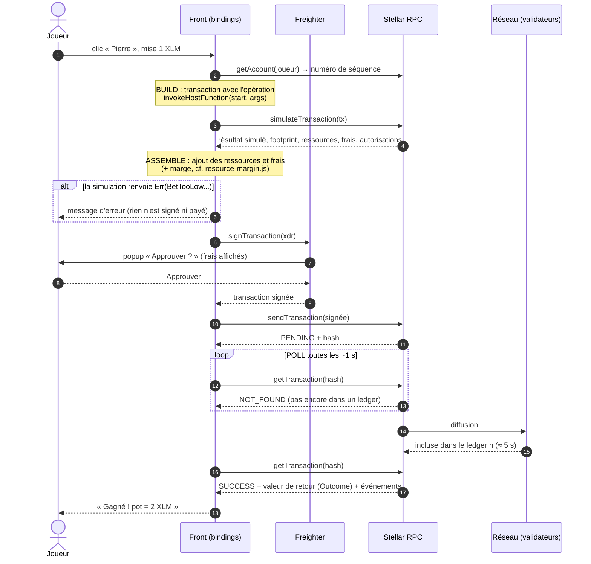

# 04 — Le cycle d'une transaction : du clic à la confirmation

> Ce qui se passe quand le joueur clique sur « Jouer Pierre » dans le front.
> Le code de référence est la fonction `write()` de `scripts/play-demo.js`.

## Vue d'ensemble

## Étape par étape

### 1. Build : construire la transaction
Une transaction Stellar contient :
- le **compte source**, qui paie les frais et signe l'enveloppe. Ici, le joueur ;
- son **numéro de séquence** + 1. Chaque transaction d'un compte a un numéro unique
  croissant, ce qui empêche de rejouer deux fois la même ;
- une **opération** `invokeHostFunction` : « appelle `start` du contrat C... avec ces
  arguments ». Les arguments sont encodés en **XDR**, le format binaire de Stellar ;
- une **date limite** (timeout), au-delà de laquelle elle est refusée.

👉 Avec les bindings, c'est la ligne `await client.start({ player, player_move, bet })`.

### 2. Simulate : la répétition générale
Le RPC exécute la transaction **pour de faux** sur l'état actuel et renvoie :
- le **résultat** (ex. `Ok(Win)`, ou `Err(BetTooLow)`) ;
- le **footprint** : la liste exacte des données lues et écrites. Une transaction Soroban
  doit les **déclarer à l'avance**, ce qui permet au réseau de traiter en parallèle les
  transactions qui ne se touchent pas ;
- les **ressources** consommées (instructions CPU, octets lus et écrits, événements) ;
- les **frais** correspondants ;
- les **autorisations** nécessaires (`require_auth`) et qui doit les signer.

Pour une **lecture** (`get_game`...), on s'arrête là : le résultat de la simulation EST la
réponse. Pas de signature, pas de frais.

> ⚠️ Spécificité de notre jeu : pour `start` et `play`, **le résultat simulé n'est pas le
> vrai** (le hasard diffère). On ne l'utilise que pour détecter les erreurs métier. Le vrai
> résultat se lit après confirmation.

### 3. Assemble : intégrer la simulation
Le SDK recopie le footprint, les ressources et les frais dans la transaction.
Chez nous, `addResourceMargin(tx)` **relève les limites** pour couvrir l'issue la plus
coûteuse. La part non utilisée des frais remboursables est rendue.

### 4. Sign : signer
Le portefeuille (Freighter) montre la transaction à l'utilisateur, qui approuve. La
signature Ed25519 couvre la transaction **et** la passphrase du réseau.
Ici, le joueur est aussi le compte source : sa signature de l'enveloppe suffit à satisfaire
`player.require_auth()`.

### 5. Send : envoyer
`sendTransaction` renvoie tout de suite un **hash** et un statut `PENDING` (ou `ERROR` si la
transaction est refusée d'emblée : mauvais numéro de séquence, frais insuffisants...).
**Envoyée ne veut pas dire exécutée.**

### 6. Poll : attendre la confirmation
On interroge `getTransaction(hash)` jusqu'à obtenir :
- `SUCCESS` : incluse et exécutée. On lit la **valeur de retour** (l'`Outcome`) et les événements ;
- `FAILED` : incluse **mais échouée**. Les frais sont quand même payés, et l'état ne change pas.
  Exemple vécu : `ResourceLimitExceeded` (voir docs/07) ;
- `NOT_FOUND` longtemps : expirée, ou jamais incluse.

👉 Avec les bindings, les étapes 4 à 6 tiennent en une ligne : `const sent = await tx.signAndSend()`.
**Vérifiez toujours** `sent.getTransactionResponse.status === "SUCCESS"`.

## Le même cycle avec la CLI
`stellar contract invoke --id double-ou-rien --source-account alice --network testnet -- get_bank`
fait build, simulate et, pour une lecture, s'arrête là. Pour une écriture, la CLI signe avec
la clé d'`alice` puis envoie et attend. Les logs « Simulating… Signing… Sending… »
correspondent exactement aux étapes ci-dessus.
