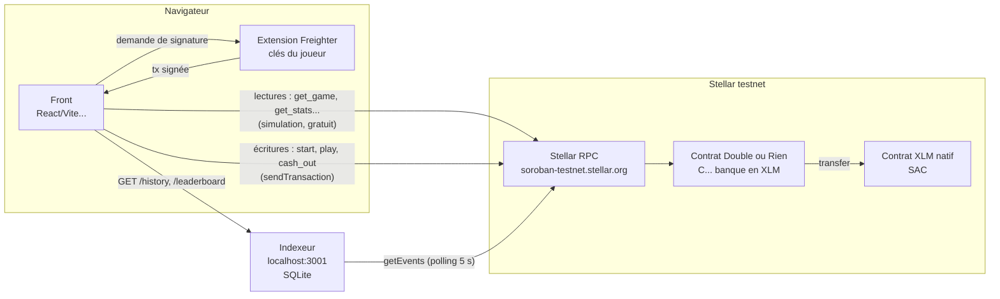

# 05 — Intégration front : le guide pour brancher l'interface

> Pour le développeur front. Tout ce qu'il faut pour afficher le jeu, faire signer les
> coups avec **Freighter** et afficher historique et classement.
> Le script `scripts/play-demo.js` est l'exemple **exécutable** de tout ce qui suit :
> en cas de doute, c'est la référence qui marche.

## 1. Architecture



| Besoin du front | Source |
|---|---|
| Partie en cours, stats du joueur, config, état de la banque | **Contrat** (lecture via le RPC) |
| Jouer, encaisser | **Contrat** (transaction signée par Freighter) |
| Historique détaillé, classement | **Indexeur** (API REST) |

## 2. Ce qu'il faut récupérer du back

1. Le dossier **`/bindings`** : le client TypeScript généré (`npm run bindings`). L'ID du
   contrat et la passphrase du testnet y sont déjà inscrits.
2. **`deployment.json`** : `contractId`, `rpcUrl`, `networkPassphrase`, `tokenId`.
3. La fonction **`addResourceMargin`** (§5, obligatoire pour `start` et `play`).
4. L'URL de l'**indexeur** : `http://localhost:3001` en local.

> ⚠️ À chaque **redéploiement** du contrat, l'ID change : il faut relancer
> `npm run bindings` et récupérer les nouveaux `/bindings` et `deployment.json`.

## 3. Installation

```bash
npm install ../chemin-vers-le-back/bindings @stellar/freighter-api
```
- `double-ou-rien-client` (les bindings) ré-exporte tout `@stellar/stellar-sdk` : pas besoin
  de l'installer séparément, ce qui évite d'avoir deux versions ;
- `@stellar/freighter-api` (v6) sert à parler à l'extension Freighter.

```ts
import { Client, Move, Outcome, networks, rpc, contract } from "double-ou-rien-client";
```
Côté joueur, installer l'extension [Freighter](https://www.freighter.app/), créer un compte,
choisir le réseau **Testnet** dans ses paramètres, puis le financer avec Friendbot (bouton
dans Freighter).

## 4. Les clients : lecture vs écriture

```ts
import { Client, networks } from "double-ou-rien-client";
import { requestAccess, signTransaction } from "@stellar/freighter-api";

const RPC_URL = "https://soroban-testnet.stellar.org";
const NETWORK_PASSPHRASE = networks.testnet.networkPassphrase;
const CONTRACT_ID = networks.testnet.contractId;

// Client LECTURE SEULE : pas de compte, pas de signature. Suffit pour get_*.
export const readClient = new Client({
  contractId: CONTRACT_ID,
  networkPassphrase: NETWORK_PASSPHRASE,
  rpcUrl: RPC_URL,
});

// Client SIGNATAIRE : créé après connexion du portefeuille.
export async function connectWallet() {
  // Ouvre la popup Freighter « autoriser ce site ? » et renvoie l'adresse G...
  const { address, error } = await requestAccess();
  if (error) throw new Error(error.message);

  const client = new Client({
    contractId: CONTRACT_ID,
    networkPassphrase: NETWORK_PASSPHRASE,
    rpcUrl: RPC_URL,
    publicKey: address, // compte source : paie les frais
    // Le SDK appelle cette fonction au moment de signer. Freighter ouvre sa popup.
    signTransaction: (xdr: string) =>
      signTransaction(xdr, { networkPassphrase: NETWORK_PASSPHRASE, address }),
  });
  return { address, client };
}
```

## 5. La marge de ressources (obligatoire pour `start` et `play`)

Le hasard de la simulation n'est pas celui du vrai ledger : sans marge, environ une
transaction sur trois échoue avec `ResourceLimitExceeded`. Explications dans
[07-debug.md](07-debug.md) et [04-cycle-transaction.md](04-cycle-transaction.md).
Version TypeScript de `scripts/lib/resource-margin.js` :

```ts
import { rpc, contract } from "double-ou-rien-client";

/** À appeler juste après `await client.start(...)` ou `play(...)`, AVANT de lire tx.result. */
export function addResourceMargin<T>(tx: contract.AssembledTransaction<T>) {
  if (!tx.simulation || !rpc.Api.isSimulationSuccess(tx.simulation)) return tx;
  const builder = tx.simulation.transactionData;
  const data = builder.build();
  const r = data.resources();
  builder
    .setResources(Math.ceil(r.instructions() * 1.3) + 200_000, r.diskReadBytes(), r.writeBytes() + 500)
    .setResourceFee(data.resourceFee().toBigInt() * 2n);
  return tx;
}
```

## 6. Une fonction d'écriture générique

```ts
import type { contract } from "double-ou-rien-client";

/** Simule → vérifie les erreurs métier → marge → signe (Freighter) → envoie → attend. */
export async function sendTx<T>(txPromise: Promise<contract.AssembledTransaction<contract.Result<T>>>): Promise<T> {
  const tx = await txPromise;           // build + simulate
  addResourceMargin(tx);                // AVANT tx.result
  if (tx.result.isErr()) {              // erreur du contrat détectée à la simulation
    throw new GameError(tx.result.unwrapErr().message);   // ex. "BetTooLow"
  }
  const sent = await tx.signAndSend();  // popup Freighter + envoi + polling
  if (sent.getTransactionResponse?.status !== "SUCCESS") {
    throw new Error("La transaction a échoué on-chain, réessayez.");
  }
  return sent.result.unwrap();          // la VRAIE valeur de retour (Outcome, montant...)
}
```

## 7. Chaque fonction du contrat

> Les montants sont des **`bigint` en stroops** : `1 XLM = 10_000_000n`.
> `const XLM = 10_000_000n; const toXlm = (s: bigint) => Number(s) / 1e7;`

### Lectures (sans signature, sans frais)

```ts
// get_config → { min_bet: bigint, max_bet: bigint, max_multiplier: number }
const { result: config } = await readClient.get_config();

// get_bank → { balance, reserved, available } (bigint)
const { result: bank } = await readClient.get_bank();

// get_game → Game | null. ATTENTION : Option::None devient null.
const { result: game } = await readClient.get_game({ player: address });
if (game == null) { /* afficher « Nouvelle partie » */ }
else {
  const multiplier = 2 ** game.wins;   // x1, x2, x4...
  // game.bet, game.pot (bigint), game.rounds (number)
}

// get_stats → { played, won, lost, biggest_win }
const { result: stats } = await readClient.get_stats({ player: address });
```

### Écritures (signature Freighter)

```ts
// start : mise + premier tour → Outcome (Win = 0, Tie = 1, Loss = 2)
const outcome = await sendTx(client.start({ player: address, player_move: Move.Rock, bet: 2n * XLM }));
if (outcome === Outcome.Win)  { /* pot doublé : proposer "Rejouer" ou "Encaisser" */ }
if (outcome === Outcome.Tie)  { /* égalité : proposer de rejouer (play) */ }
if (outcome === Outcome.Loss) { /* perdu */ }

// play : remettre tout le pot en jeu → Outcome
const outcome2 = await sendTx(client.play({ player: address, player_move: Move.Paper }));

// cash_out : encaisser → montant versé (bigint)
const paid = await sendTx(client.cash_out({ player: address }));
```
Après chaque écriture, **relire** `get_game` pour afficher le nouveau pot. Le coup de la
banque n'est pas renvoyé par la fonction : il est dans l'événement `round_played`, donc
disponible via l'indexeur (`/history`). On peut aussi le déduire : si victoire avec Pierre,
la banque a joué Ciseaux.

### Admin (réservé à l'adresse admin, à mettre dans une page à part)
```ts
await sendTx(client.withdraw({ amount: 10n * XLM }));
await sendTx(client.set_config({ config: { min_bet: XLM, max_bet: 10n * XLM, max_multiplier: 32 } }));
```

### Afficher les boutons selon l'état

| État (`get_game`) | Boutons |
|---|---|
| `null` | choix du coup + mise → `start` |
| `wins === 0` (égalité au 1er tour) | choix du coup → `play` |
| `wins ≥ 1` et `2^(wins+1) ≤ max_multiplier` | `play` **ou** `cash_out` |
| `wins ≥ 1` et `2^(wins+1) > max_multiplier` | `cash_out` uniquement |

## 8. Gestion des erreurs : code → message

`tx.result.unwrapErr().message` contient le **nom** de l'erreur Rust. Le code numérique
correspond à ce que la CLI affiche (`Error(Contract, #3)`).

```ts
export const ERROR_MESSAGES: Record<string, string> = {
  GameAlreadyInProgress:       "Vous avez déjà une partie en cours : jouez ou encaissez.",       // 1
  NoGameInProgress:            "Aucune partie en cours.",                                         // 2
  BetTooLow:                   "Mise trop faible.",                                               // 3
  BetTooHigh:                  "Mise trop élevée.",                                               // 4
  BankInsufficient:            "La banque ne peut pas couvrir ce gain : encaissez ou misez moins.", // 5
  MaxMultiplierReached:        "Multiplicateur maximum atteint : encaissez !",                    // 6
  NothingToCashOut:            "Gagnez au moins un tour avant d'encaisser.",                      // 7
  InvalidConfig:               "Configuration invalide.",                                         // 8
  InsufficientBankForWithdraw: "Retrait supérieur aux fonds disponibles.",                         // 9
  InvalidAmount:               "Montant invalide.",                                               // 10
};

export class GameError extends Error {
  constructor(public code: string) { super(ERROR_MESSAGES[code] ?? code); }
}
```

Autres erreurs à prévoir :

| Situation | Symptôme | Message utilisateur |
|---|---|---|
| Freighter absent | `isConnected()` renvoie `false` | « Installez Freighter » |
| Refus dans la popup | exception levée par `signAndSend` | « Transaction annulée » |
| Mauvais réseau dans Freighter | échec de signature ou d'envoi | « Passez Freighter sur Testnet » |
| Solde XLM insuffisant | échec de simulation (transfer) | « Solde insuffisant » |
| Statut `FAILED` | notre `sendTx` lève une erreur | « Échec réseau, réessayez » |

## 9. L'API de l'indexeur

Base : `http://localhost:3001`. CORS ouvert. **Montants en chaînes (stroops).**

### `GET /health`
```json
{
  "status": "ok",
  "contractId": "CAI7IXIL75RFOVQSUBLSSXX6CPTB6H2XQU6DVCS3QF44VUKARVGHW4JA",
  "latestLedger": 4918441,
  "lastPollAt": "2026-09-28T17:16:37.089Z",
  "lastError": null,
  "eventsIndexed": 51
}
```

### `GET /history/:address?limit=50`
Du plus récent au plus ancien. Types : `round_played`, `cashed_out`, `game_lost`.
```json
{
  "address": "GDII3TEPNZP2WZDPA2OPR45WCWVMFKPSISK2AS4ALOLEYHFYEJTTEGTV",
  "events": [
    { "type": "game_lost", "ledger": 4918390, "closedAt": "2026-09-28T17:12:17Z",
      "txHash": "7404ad98...", "player": "GDII...", "bet": "10000000", "lost_pot": "20000000", "wins": 1 },
    { "type": "round_played", "ledger": 4918390, "closedAt": "2026-09-28T17:12:17Z",
      "txHash": "7404ad98...", "player": "GDII...", "player_move": "Scissors", "bank_move": "Rock",
      "outcome": "Loss", "pot": "0", "rounds": 8, "wins": 1 },
    { "type": "cashed_out", "ledger": 4918350, "closedAt": "...", "txHash": "93c447a0...",
      "player": "GDII...", "bet": "10000000", "amount": "80000000", "multiplier": 8 }
  ]
}
```
Une adresse invalide renvoie `400 {"error": "Adresse Stellar invalide (attendu : G...)"}`.

### `GET /leaderboard?limit=10`
```json
{
  "biggestWins": [
    { "player": "GDII...", "amount": "80000000", "multiplier": 8,
      "closedAt": "2026-09-28T17:11:02Z", "txHash": "93c447a0..." }
  ],
  "biggestMultipliers": [
    { "player": "GDII...", "multiplier": 8, "amount": "80000000",
      "closedAt": "2026-09-28T17:11:02Z", "txHash": "93c447a0..." }
  ]
}
```
Lien vers une transaction : `https://stellar.expert/explorer/testnet/tx/${txHash}`.

> L'indexeur a un décalage de 5 à 10 s. Après une action, affichez d'abord le résultat
> renvoyé par le contrat, puis rafraîchissez l'historique un peu plus tard.

## 10. Checklist de branchement

- [ ] Le back a tourné : `npm run deploy`, puis `npm run bindings`, puis `npm run indexer`
- [ ] `/bindings` récupéré et installé (`npm install <chemin>/bindings`)
- [ ] `@stellar/freighter-api` installé, Freighter réglé sur **Testnet** et compte financé
- [ ] `readClient` affiche `get_config` et `get_bank` au chargement
- [ ] Bouton « Connecter » → `requestAccess()` → client signataire
- [ ] `get_game` au chargement et après chaque action (`null` = pas de partie)
- [ ] `sendTx` utilisé pour start/play/cash_out, **avec** `addResourceMargin`
- [ ] Vérification de `status === "SUCCESS"` après envoi
- [ ] Table `ERROR_MESSAGES` branchée
- [ ] Boutons affichés selon l'état (tableau §7)
- [ ] Historique et classement via l'indexeur (montants en stroops → XLM)
- [ ] Liens stellar.expert sur les `txHash`

> 💡 Si Vite se plaint de `Buffer` ou `global` non défini :
> `npm install buffer`, puis dans `vite.config.ts` : `define: { global: "globalThis" }`.
