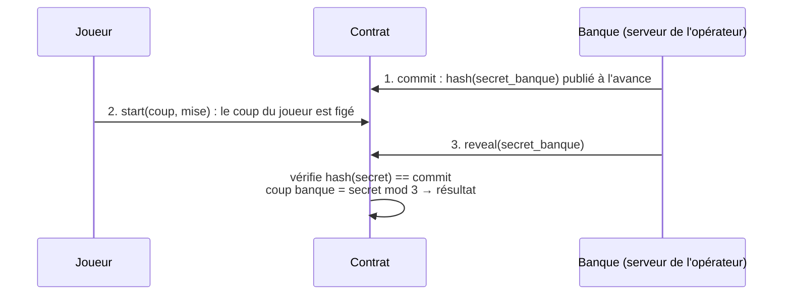

# 06 — Sécurité : ce qui est solide, ce qui ne l'est pas

> Être honnête sur les limites fait partie d'un bon pitch. Ce document dit ce qu'un
> attaquant pourrait faire, et comment on le corrigerait en production.

## 1. Ce qui est solide ✅

| Protection | Où |
|---|---|
| Personne ne mise ni n'encaisse pour un autre | `player.require_auth()` dans start, play, cash_out |
| Seul l'admin retire ou reconfigure | `read_admin(&env).require_auth()` |
| L'admin ne peut pas voler les joueurs | `withdraw` limité à `solde − reserved` |
| La banque ne promet jamais plus qu'elle n'a | vérification de solvabilité avant chaque tour |
| Pas de ré-initialisation possible | `__constructor` (exécuté une seule fois au déploiement) |
| Pas de dépassement d'entier silencieux | `overflow-checks = true` + `checked_pow` |
| Atomicité | toute erreur annule tout, y compris les transferts |
| Une seule partie à la fois | `GameAlreadyInProgress` |

## 2. La faille principale : le hasard `env.prng()` 🎲

### 2.1 Le problème
`env.prng()` est un générateur **pseudo**-aléatoire : sa graine est dérivée des données du
ledger et de la transaction. La documentation du SDK prévient qu'il est inadapté aux usages
à risque. Deux attaques sont possibles.

**Attaque A : le contrat qui annule quand il perd (« revert on loss »)**
Un attaquant déploie **son propre contrat** qui appelle le nôtre :
```rust
// Contrat attaquant (pseudo-code)
pub fn attack(env: Env, target: Address) {
    let game = DoubleOuRienClient::new(&env, &target);
    let outcome = game.play(&env.current_contract_address(), &Move::Rock);
    if outcome == Outcome::Loss {
        panic!("perdu → j'annule tout");   // toute la transaction est annulée
    }
}
```
- Quand il **gagne**, la transaction passe et le pot double.
- Quand il **perd**, il fait échouer la transaction : la défaite **n'a jamais eu lieu**. Il
  ne paie que les frais (quelques centimes).
- En relançant jusqu'à gagner, il transforme un jeu à 50 % en jeu à **100 %**.

**Pourquoi « double ou rien » amplifie l'attaque** : dans un jeu à un seul tour, gagner à
coup sûr rapporte x2. Ici, l'attaquant enchaîne les victoires « gratuites » jusqu'au
multiplicateur maximum : x32 pour 1 XLM misé, soit **32 XLM** pour quelques centimes de frais
par essai. Il répète l'opération jusqu'à **vider la banque**. Notre vérification de
solvabilité limite chaque partie, mais pas le nombre de parties.

**Attaque B : prédire le tirage**
Un validateur (ou quelqu'un qui connaît la graine) pourrait anticiper le coup de la banque.
Sur Stellar, c'est difficile pour un simple utilisateur, mais c'est un risque de principe.

### 2.2 Parades
| Parade | Idée | Limite |
|---|---|---|
| Interdire les contrats appelants | refuser si `player` est une adresse `C...` | contournable (smart wallets), et bloque des usages légitimes |
| **Commit-reveal** | voir §3 | 2 transactions par tour |
| Oracle de hasard vérifiable (VRF) | un service externe fournit un nombre aléatoire avec une preuve | dépendance externe |
| Tirage **différé** | le résultat dépend d'un ledger **futur** (ex. `current + 5`), révélé plus tard | 2 transactions, et le hasard du ledger reste influençable par les validateurs |

## 3. Le principe du commit-reveal

L'idée : **s'engager** sur une valeur secrète, puis la **révéler** quand il est trop tard
pour tricher.


- La banque ne peut plus changer son secret après le commit, car le hash la trahirait.
- Le joueur ne connaît pas le secret quand il joue, puisqu'il ne voit que le hash.
- Plus d'attaque « revert on loss » : le résultat n'est connu qu'**après** la transaction
  du joueur. Annuler son propre coup ne sert plus à rien.
- Il faut gérer la **banque qui refuse de révéler** quand le résultat lui est défavorable :
  un délai au-delà duquel le joueur gagne par forfait.

En **joueur contre joueur**, c'est encore plus simple : chacun commit `hash(coup + sel)`,
puis chacun révèle. C'est l'exercice 7 de [08-exercices.md](08-exercices.md).

## 4. Les autres risques

### 4.1 La banque vidée
- Par la faille PRNG (§2) : c'est le risque réel.
- Par la chance : le jeu est équitable (espérance nulle), donc une série de gains peut
  réduire la caisse. La vérification `BankInsufficient` empêche la faillite, mais les
  joueurs sont alors bloqués sur les gros paris. **Surveillance** : `get_bank().available`,
  puis réalimentation par un simple `transfer` vers le contrat.

### 4.2 Le TTL expiré (state archival)
- **Instance** (config, admin, réserve et le code) : si personne n'appelle le contrat
  pendant plus de 30 jours, elle est archivée. Le contrat est alors inutilisable jusqu'à un
  `restore` (payant, possible par n'importe qui). Les XLM ne sont **pas perdus**.
  Parade : un petit script ou cron qui appelle `stellar contract extend` régulièrement.
- **Partie d'un joueur** (persistent) : si un joueur abandonne une partie gagnante plus de
  30 jours, l'entrée est archivée. `Reserved` continue de compter son pot : l'argent reste
  bloqué dans la réserve jusqu'à restauration. Avec `restore: true`, le SDK peut restaurer
  automatiquement.

### 4.3 Une partie abandonnée
Un joueur qui gagne x16 puis ne revient jamais **immobilise** son pot dans `reserved`. En
production, on ajouterait une **expiration** : après N jours, n'importe qui peut déclencher
l'encaissement automatique vers le joueur.

### 4.4 La clé admin
Elle peut vider les fonds **libres** et changer la config. En production, on utiliserait un
compte **multisig** (plusieurs signatures requises) ou une timelock.

### 4.5 Le front et la simulation
Le résultat simulé de `start` et `play` **n'est pas** le vrai résultat (hasard différent). Un
front qui afficherait le résultat simulé mentirait au joueur. On affiche toujours `sent.result`.

## 5. Ce qu'on dit au jury (30 secondes)

> « Notre contrat protège les fonds : autorisations, réserve des pots promis et
> vérification de solvabilité. L'admin lui-même ne peut pas toucher à l'argent des joueurs.
> Par contre, nous savons que `env.prng()` n'est pas un hasard sûr : un contrat attaquant
> peut annuler ses défaites, ce qui est particulièrement dangereux en double ou rien car
> il enchaînerait les x2 gratuitement. C'est acceptable sur le testnet pour une démo. En
> production, nous passerions à un **commit-reveal** ou à un **oracle VRF**, et nous avons
> documenté comment. »
