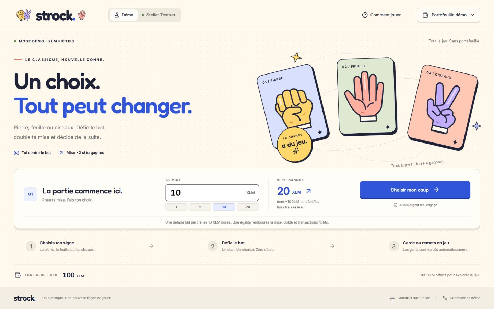
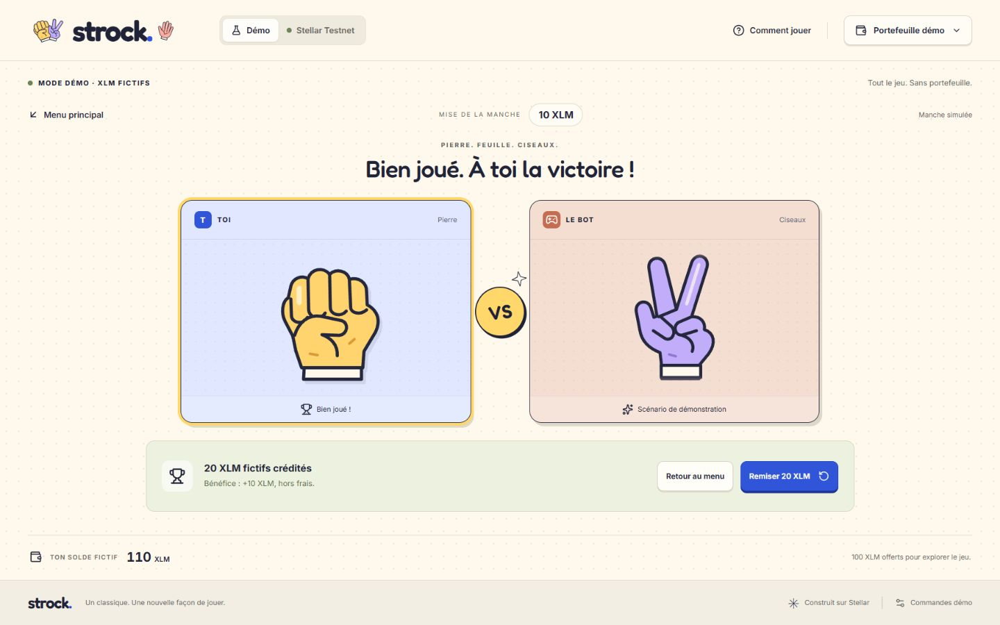

# Vérification de livraison — 29 septembre 2026

## Vérifié

- **51 tests automatisés réussis** : les neuf combinaisons pierre-feuille-ciseaux, montants décimaux exacts et limites, affichage du solde, liens de transaction, paiement et bénéfice, remise des gains en jeu, égalités répétées, transitions, absence de double paiement après reprise, erreurs et suivi RPC, connexion Freighter avec réponses simulées.
- **Compilation de production réussie**, TypeScript strict. Dépendances du front installées sans environnement Rust.
- **Parcours dans le navigateur sur la version compilée** : 100 → mise 10, victoire → 110 ; remiser 20, égalité → 110 ; rejouer 20, victoire → 130 ; remiser 40, défaite → 90 et retour au menu.
- **Interruption après envoi simulé** : actualisation, récupération de la référence, confirmation et un seul crédit. Aucun bouton de nouvelle mise pendant l’attente.
- **Confirmation lente simulée** : solde non crédité avant vérification ; reprise après actualisation en conservant la mise de 20 XLM, puis versement de 40 XLM et solde de 120 depuis 100.
- **Refus de signature et banque insuffisante simulés** : message explicite, choix réactivés et solde inchangé.
- **Freighter absent** dans le navigateur intégré : message explicite ; aucun solde fictif affiché comme solde Testnet.
- **Clavier** : soumission de mise avec Entrée, activation d’un choix au clavier, fermeture des fenêtres avec Échap. Préférence de réduction des animations utilisée pour une manche.
- **Affichage PC** contrôlé en 1366 × 768, 1440 × 900 et 1920 × 1080. Menu et arène tiennent sans défilement dans ces tailles, hors messages supplémentaires d’erreur/suivi. Aucun parcours mobile ajouté.
- **Contrôle Testnet en lecture seule** : RPC sain, contrat configuré accessible, banque à 182 XLM au moment du contrôle, réserve de base à 0,5 XLM. Ces valeurs peuvent évoluer.

Les tests RPC et Freighter utilisent des réponses simulées avec le décodage des vrais bindings. Ils ne prouvent pas qu’une transaction a été signée et exécutée avec le portefeuille de l’équipe.

## À faire sur le poste de présentation

- [ ] Ouvrir le front dans le navigateur équipé de Freighter, sélectionner Testnet et connecter le compte de l’équipe.
- [ ] Vérifier son solde disponible et la réserve de la banque avec le script de contrôle.
- [ ] Signer une petite manche et comparer choix, résultat, paiement et frais avec Stellar Lab via « Voir la transaction ». Rejouer une manche et vérifier que le lien contient son nouveau hash.
- [ ] Refuser une signature et vérifier l’absence de nouvelle transaction.
- [ ] Actualiser après un envoi et vérifier la reprise via le hash conservé, sans nouvelle demande de mise.
- [ ] Revenir au mode démo, sélectionner « Parcours jury », réinitialiser à 100 XLM fictifs et répéter le pitch en plein écran.
- [ ] Confirmer l’heure du mercredi 30 septembre et garder une marge avant le jury.

**État de livraison :** démo autonome jouable et vérifiée ; intégration Testnet implémentée, essai signé avec Freighter restant à réaliser par l’équipe.

## Correction du lien de transaction — 29 septembre 2026

- Transaction réelle `ca5ec5c48acbe88e9271a7e1736c66a23d0213292405b30e67a3f4183246187e` retrouvée par le RPC et Horizon, alors que Stellar Expert répond « transaction introuvable ».
- Ouverture directe du nouveau lien dans un nouvel onglet vérifiée : Stellar Lab affiche `Success`, l’appel `play`, une mise de 100 000 000 stroops (10 XLM) et un paiement de 200 000 000 stroops (20 XLM).
- Liens du résultat et du menu construits à partir du hash courant, sans transaction fixe. Tests de deux hashes successifs et rejet des références absentes, simulées ou invalides.

## Captures

